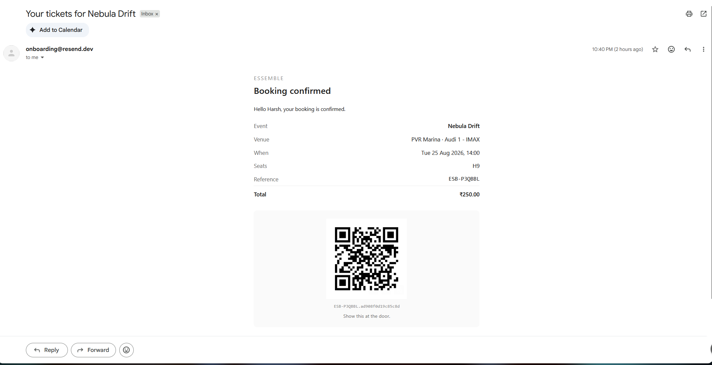

# ESSEMBLE

**Find your event. Find your place.**

A full-stack ticket-booking platform for movies and live events. Customers book seats from a visual map with real-time status; held seats auto-release on checkout abandonment; sold-out categories have a waitlist with automatic seat assignment on cancellation; every confirmed booking produces an emailed QR ticket.

| | |
|---|---|
| **Live app** | [https://essemble-murex.vercel.app/](https://essemble-murex.vercel.app/) |
| **API** | [https://essemble-api.onrender.com/](https://essemble-api.onrender.com/) |
| **API docs** | [https://essemble-api.onrender.com/docs](https://essemble-api.onrender.com/docs) |
| **Design write-up** | [SYSTEM_DESIGN.md](SYSTEM_DESIGN.md) |

> The API is hosted on Render's free tier and sleeps after 15 minutes of inactivity. **The first request can take up to 60 seconds** while the instance wakes; the frontend shows a "waking the server" state during this. Subsequent requests are immediate.

---

## Demo credentials

Password for all accounts: `essemble123`

| Email | Role | Purpose |
|---|---|---|
| `admin@essemble.dev` | Admin | Owns 2 venues, 5 screens, full seat layouts |
| `organiser@essemble.dev` | Organiser | Owns 6 events, 33 scheduled shows |
| `new@essemble.dev` | Customer | No booking history |
| `regular@essemble.dev` | Customer | ~4 months of history |

The two customer accounts exist so the same query returns different recommendations depending on history.

### Suggested walkthrough

1. Sign in as `regular@essemble.dev`, pick an event, choose language/format → date → venue → showtime.
2. On the seat map, open the **same show in a second browser window**. Hold seats in one; watch them turn hatched in the other within a second. That is the real-time layer.
3. Hold seats, note the countdown, confirm. The QR ticket appears and an email is dispatched.
4. Cancel the booking from **Profile → Upcoming**. If anyone is waitlisted on that category, an offer is created and emailed immediately.
5. Open the offer link (`/offers/<token>`) — a public page with a countdown. Claim it once; try again and it is gone.

---

## Roles

| | Responsibility |
|---|---|
| **Admin** | Venue infrastructure — venues, screens, seat layouts, seat categories, QR check-in |
| **Organiser** | Shows — event listings, scheduling, per-category pricing, revenue and occupancy |
| **Customer** | Browse, book, hold, pay (mocked), cancel, waitlist |

The important data-model split: **Admin defines which category a seat belongs to; Organiser sets that category's price for a particular show.** Category membership is venue-level (`seat.category_id`); price is show-level (`show_category_price`).

---

## Setup

### Prerequisites
PostgreSQL 15+ (any provider), Python 3.10+, Node 18+.

### Backend

```bash
cd backend
python -m venv .venv && source .venv/bin/activate   # Windows: .venv\Scripts\activate
pip install -r requirements.txt
cp .env.example .env          # then fill in DATABASE_URL, JWT_SECRET, QR_SECRET
alembic upgrade head
python scripts/seed.py
uvicorn app.main:app --reload
```

API at `http://127.0.0.1:8000`, docs at `/docs`.

`JWT_SECRET` and `QR_SECRET` have **no defaults** — the app refuses to start without them. Generate with:

```bash
python -c "import secrets; print(secrets.token_urlsafe(48))"
```

### Frontend

```bash
cd frontend
npm install
echo "NEXT_PUBLIC_API_BASE_URL=http://127.0.0.1:8000" > .env.local
npm run dev
```

App at `http://localhost:3000`.

### Notes

- Use your database's **direct** connection endpoint, not a transaction pooler. The app refuses pooled DSNs at startup: `LISTEN/NOTIFY` (used for real-time seat updates) does not survive transaction pooling. Neon: use the host without `-pooler`. Supabase: port 5432, not 6543.
- `MAIL_DRIVER=console` (the default) prints rendered emails to stdout, so the app runs fully without mail credentials. Set `MAIL_DRIVER=resend` with a `RESEND_API_KEY` to send real mail.
- `CORS_ORIGINS` and `APP_BASE_URL` must have **no trailing slash**. Browsers send `Origin` without one.

---

## Environment

See [`backend/.env.example`](backend/.env.example) for the full list with comments.

| Variable | Default | Purpose |
|---|---|---|
| `DATABASE_URL` | — | Postgres DSN, direct endpoint only |
| `JWT_SECRET` | *none* | Token signing. No default; startup fails if unset |
| `QR_SECRET` | *none* | Ticket HMAC. No default; startup fails if unset |
| `HOLD_TTL_SECONDS` | `600` | Seat hold lifetime |
| `WAITLIST_OFFER_TTL_SECONDS` | `900` | Time-limited offer window |
| `SWEEPER_INTERVAL_SECONDS` | `10` | Expiry sweep cadence |
| `MAX_SEATS_PER_HOLD` | `10` | Seats per hold |
| `CANCELLATION_CUTOFF_MINUTES` | `60` | No cancellation this close to showtime |
| `MAIL_DRIVER` | `console` | `console` or `resend` |
| `APP_BASE_URL` | — | **Frontend** origin — waitlist offer links point here |
| `CORS_ORIGINS` | `http://localhost:3000` | Comma-separated allowlist |

---

## API

Full interactive documentation at `https://essemble-api.onrender.com/docs` — 35 operations, tagged by domain.

```
Auth        POST /api/auth/register · POST /api/auth/login · GET /api/auth/me
Catalog     GET  /api/events · /api/events/{id} · /api/events/{id}/showtimes
Seat map    GET  /api/shows/{id}/seatmap?since={version}
            GET  /api/shows/{id}/seatmap/stream          (SSE)
Booking     POST /api/holds · GET|DELETE /api/holds/{id}
            POST /api/holds/{id}/confirm
            GET  /api/bookings · POST /api/bookings/{ref}/cancel
Waitlist    POST /api/waitlist · GET /api/waitlist
            GET  /api/waitlist/offers/{token}
            POST /api/waitlist/offers/{token}/claim
Organiser   POST /api/organiser/events · /api/organiser/shows
            GET  /api/organiser/shows/{id}/summary
Admin       CRUD /api/admin/venues · /api/admin/venues/{id}/screens
            POST /api/admin/screens/{id}/layout
            POST /api/admin/venue-requests/{id}/decision
Check-in    POST /api/checkin/verify
Health      GET  /api/health
```

**Errors** use one envelope everywhere, including validation failures:

```json
{ "error": { "code": "SEAT_UNAVAILABLE", "message": "...", "details": { "seat_ids": [27] } } }
```

Codes: `SEAT_UNAVAILABLE`, `HOLD_EXPIRED`, `HOLD_LIMIT_EXCEEDED`, `OFFER_EXPIRED`, `NOT_SOLD_OUT`, `INVALID_SIGNATURE`, `ALREADY_USED`, `NOT_FOUND`, `CONFLICT`, `FORBIDDEN`, `VALIDATION_ERROR`.

`POST /api/holds` and `POST /api/holds/{id}/confirm` honour an `Idempotency-Key` header.

---

## Database schema

16 tables. The full DDL is in [`backend/alembic/versions/`](backend/alembic/versions/).

```
user_account ──┬── venue ── screen ──┬── seat_category
               │                     └── seat (row, number, x, y, category)
               │
               ├── event ── show ── show_category_price
               │              │
               │              ├── seat_claim  ← the booking engine's only truth
               │              ├── booking ── booking_seat
               │              └── waitlist_entry ── waitlist_offer
               │
               └── venue_request        outbox · idempotency_key
```

**The one index that matters:**

```sql
CREATE UNIQUE INDEX one_active_claim
  ON seat_claim (show_id, seat_id)
  WHERE state IN ('held','booked');
```

This is the concurrency control. It is not advisory and not application-enforced — two simultaneous holds on the same seat cannot both be written, regardless of code path or instance count.

Note there is **no status column on `seat`**. Seat status for a show is derived from `seat_claim` at read time. See the design document for why.

---

## Seat holds and TTL

A hold is a `seat_claim` row with `state='held'` and `expires_at = now() + HOLD_TTL_SECONDS`.

Expiry works in two layers, and the authoritative one is not the background worker:

- **Lazy expiry is the truth.** Every read filters `expires_at > now()`; every acquisition can atomically take over an expired claim. A hold is functionally released the instant its timestamp passes, with no process running.
- **The sweeper materialises side effects** — the state transition, the version bump, the real-time event, the waitlist cascade — every 10 seconds using `FOR UPDATE SKIP LOCKED`.

This matters in practice: the free-tier host sleeps. A scheduler-only design would silently stop releasing seats while asleep. Here, sleeping only delays the notification.

Acquisition never reads availability first. There is no check-then-insert anywhere in the path — one `INSERT ... ON CONFLICT` per seat, seats ordered ascending, all-or-nothing across a multi-seat request.

## Waitlist and time-limited offers

Waitlist is per seat category; position is computed from `created_at` on read, never stored.

On cancellation, in one transaction: claims released → seats grouped by category → oldest fitting `waiting` entry selected `FOR UPDATE SKIP LOCKED` → offer created → **the freed seats are immediately re-claimed** as `holder_type='waitlist_offer'` so nobody else can take them → offer email queued.

The offer token is 32 random bytes; only its SHA-256 hash is stored. Claiming is a single guarded `UPDATE ... WHERE state='pending' AND expires_at > now()` — the row count enforces single use. An unclaimed offer expires on the same sweeper and cascades to the next fitting entry, or releases the seats if the queue is empty.

Full detail in [`docs/SYSTEM_DESIGN.md`](docs/SYSTEM_DESIGN.md).

---

---

## Email delivery

Emails are queued to an `outbox` table inside the booking transaction and
delivered by a background worker with retry and exponential backoff — a mail
provider failure can never roll back or delay a confirmed booking.

Three templates: booking confirmation (with QR), waitlist offer (tokenised
claim link and countdown), and cancellation.



Real delivery is verified end to end against Resend on the deployed instance.
The QR encodes `{APP_BASE_URL}/checkin/{reference}.{signature}` so a phone
camera opens the check-in page directly rather than reading inert text.

`MAIL_DRIVER=console` is the default and renders emails to stdout, so the app
runs fully with no mail credentials. With `MAIL_DRIVER=resend` and Resend's
shared sender (`onboarding@resend.dev`), delivery is restricted to the Resend
account owner's address until a domain is verified — seeded demo accounts
therefore render to the log rather than sending.

## AI booking assistant

Natural-language search and seat ranking, backed by four read-only tools:
`find_shows`, `get_show_availability`, `rank_seats`, `get_user_context`.

The model has **no write access** to booking state — no hold, confirm, cancel,
or claim tool exists. It resolves intent into structured filters, calls the
same availability logic the seat map uses, and returns ranked options with the
score components behind them. Tapping an option enters the normal booking flow
with seats pre-selected but not held; the customer still presses hold.

Availability is enforced in SQL shared by every tool, so a held or booked seat
cannot appear in a suggestion regardless of what the model says. Show and seat
ids in a reply are checked against a ledger of ids that actually came back from
a tool call.

Runs on Groq (`openai/gpt-oss-120b`), configured via `GROQ_API_KEY`. With no key
set, assistant routes return 503 and the rest of the app is unaffected.

## Concurrency proof

`scripts/concurrency_test.py` demonstrates the guarantee end to end over HTTP against a running server — not in-process, and not sequentially. All clients are released through a barrier, and each scenario asserts that every request was still in flight when the first reply arrived.

```bash
python scripts/concurrency_test.py --base-url http://127.0.0.1:8000
```

```
==============================================================================
                          ESSEMBLE CONCURRENCY PROOF
==============================================================================

SCENARIO 1  Simultaneous holds on one seat
  50 distinct users, one seat, released together
  departure spread  119.2 ms across 50 requests (sd 31.4 ms)
  overlap           last request left 1198.8 ms before the first reply arrived
  --------------------------------------------------------------------------
  CHECK                                           EXPECTED      ACTUAL
  HTTP 201 (hold granted)                                1           1  ok
  HTTP 409 (seat taken)                                 49          49  ok
  error code SEAT_UNAVAILABLE                           49          49  ok
  all requests in flight simultaneously               True        True  ok
  DB: active claims on that seat                         1           1  ok
  PASS

SCENARIO 2  Simultaneous confirms of one hold
  20 concurrent confirms of a single hold group
  --------------------------------------------------------------------------
  HTTP 201 (booking created)                             1           1  ok
  replayed or rejected                                  19          19  ok
  DB: bookings for that hold group                       1           1  ok
  PASS

SCENARIO 3  Overlapping multi-seat holds
  20 clients want (A,B,C), 20 want (C,D,E)
  --------------------------------------------------------------------------
  HTTP 201 (holds granted)                               1           1  ok
  HTTP 409 (lost the race)                              39          39  ok
  DB: the contested seat is held exactly once            1           1  ok
  DB: winning set is whole and exclusive              True        True  ok
  PASS

SCENARIO 4  Simultaneous claims of one offer
  10 concurrent claims with the same single-use token
  --------------------------------------------------------------------------
  HTTP 201 (offer claimed)                               1           1  ok
  HTTP 410 (already used)                                9           9  ok
  DB: bookings from that offer                           1           1  ok
  PASS

==============================================================================
                 PASS   4 scenarios, 25 assertions, 0 failed
==============================================================================
```

Scenario 3 is the important one: it tests the application-level invariant rather than the database constraint. Every losing multi-seat request left **zero** partial holds behind.

---

## Tests

```bash
cd backend
export TEST_DATABASE_URL=<a database of its own>
pytest
```

151 tests. The suite truncates every application table, so it refuses to run unless `TEST_DATABASE_URL` is set and names a different database from `DATABASE_URL` — it compares host and database name with any pooler suffix stripped, so pointing it at the pooled spelling of your production host is still caught.

---

## Stack

```
Next.js 16 · React · TypeScript · Tailwind        →  Vercel
FastAPI · SQLAlchemy 2 · Alembic · APScheduler    →  Render
PostgreSQL 15                                     →  Neon
```

No Redis. Holds, TTL and concurrency are correct in Postgres alone, and a database constraint is a stronger guarantee than an external lock service.

Real-time uses Postgres `LISTEN/NOTIFY` fanned out over SSE, with a versioned polling fallback (`?since=`) that runs continuously as a safety net — so a stream that dies quietly cannot leave the seat map wrong under a confident "live" indicator.